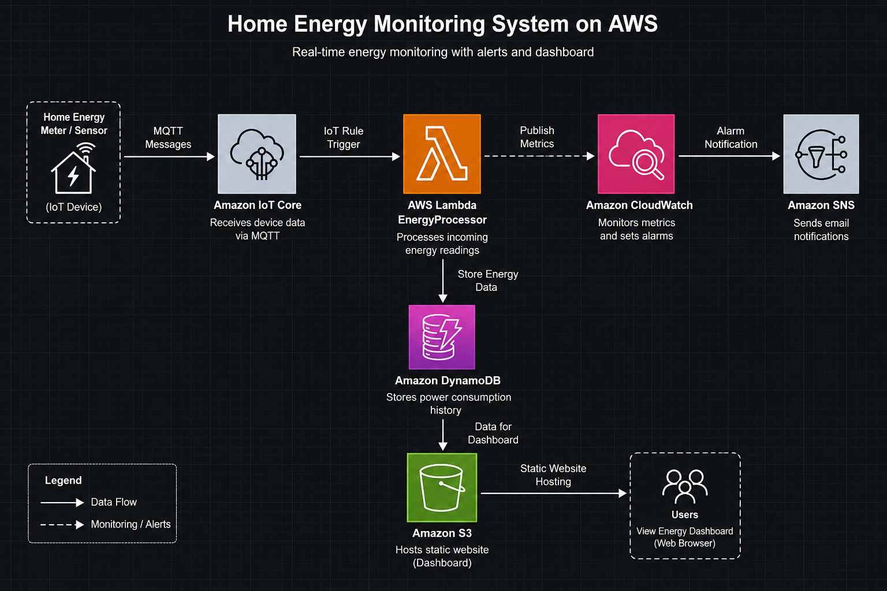
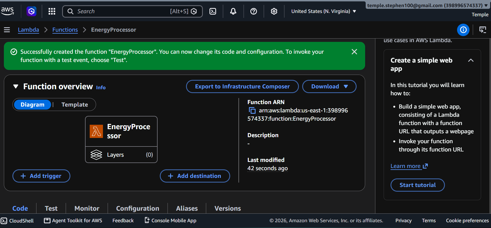
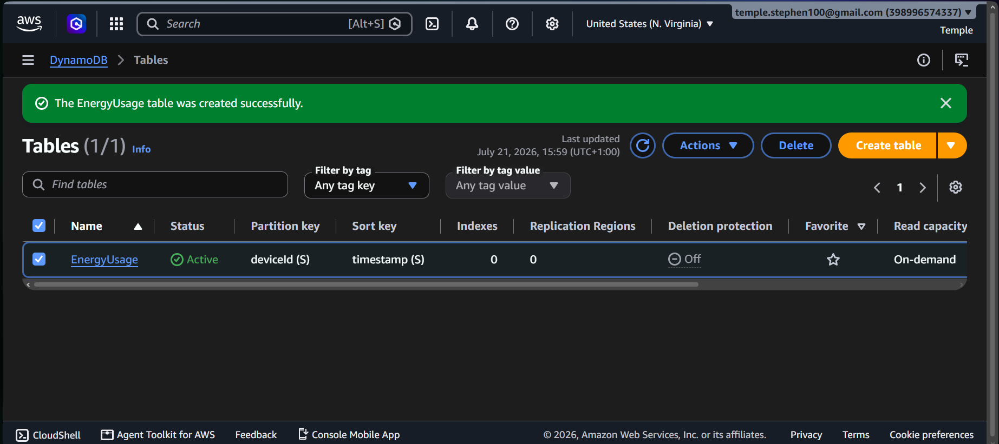
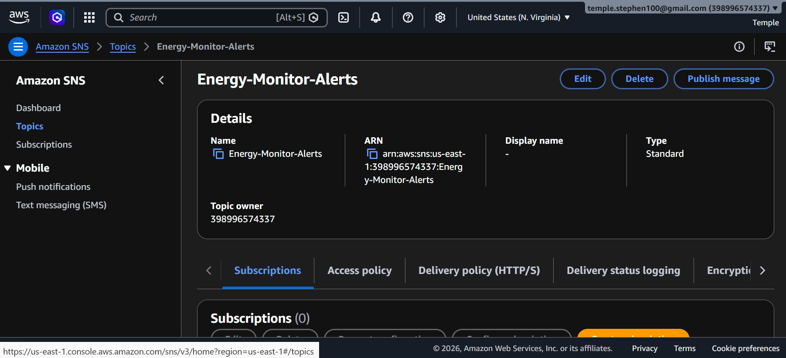
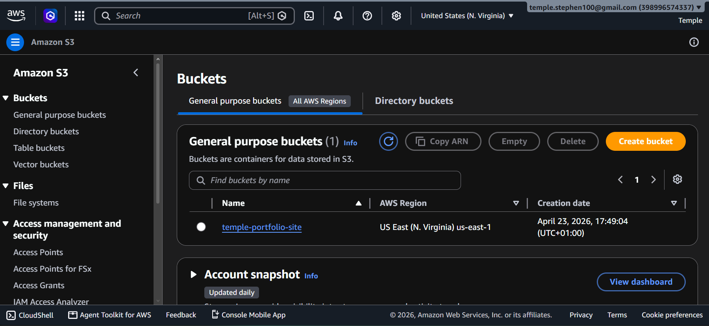
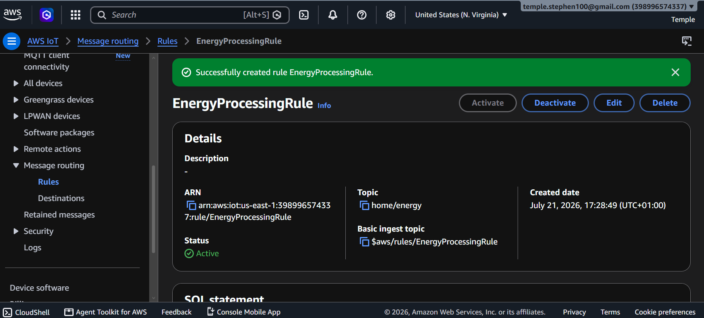

<p align="center">
  
</p>

<h1 align="center">🏡 AWS Serverless Home Energy Monitor</h1>

<p align="center">
  <b>A serverless AWS solution that simulates real-time home energy monitoring using AWS IoT Core, AWS Lambda, DynamoDB, CloudWatch, and Amazon SNS.</b>
</p>

<p align="center">
  
  
  
  
  
  
  
  
  
</p>

<p align="center">
  <a href="#-overview">Overview</a> •
  <a href="#-objectives">Objectives</a> •
  <a href="#️-solution-architecture">Architecture</a> •
  <a href="#-aws-services-used">Services</a> •
  <a href="#-project-screenshots">Screenshots</a> •
  <a href="#-deployment">Deploy</a> •
  <a href="#-skills-demonstrated">Skills</a>
</p>

---

## 📖 Overview

As part of my AWS Solutions Architect learning journey, I built this project to demonstrate how a modern serverless architecture can be used to monitor home energy consumption in real time.

The solution simulates smart energy devices sending electricity usage data into AWS. Incoming readings are processed by **AWS Lambda**, stored in **Amazon DynamoDB**, monitored with **Amazon CloudWatch**, and trigger **Amazon SNS** email notifications whenever energy consumption exceeds a defined threshold.

The project demonstrates how multiple AWS managed services can work together to build a scalable, event-driven cloud application — with zero servers to provision or maintain.

---

## 🎯 Objectives

- Build a fully serverless AWS application
- Process IoT messages in real time
- Store structured energy readings reliably
- Monitor workloads using CloudWatch
- Trigger threshold-based notifications through SNS
- Demonstrate AWS architecture best practices

---

## 🏗️ Solution Architecture

<p align="center">
  
</p>

### 🔄 Architecture Flow

```text
Smart Energy Device
        │
        ▼
  AWS IoT Core
        │
        ▼
  AWS Lambda
        │
        ▼
 Amazon DynamoDB
        │
        ▼
 Amazon CloudWatch
        │
        ▼
   Amazon SNS
        │
        ▼
 Email Notification
```

**Flow summary:** A simulated smart energy device publishes a reading to **AWS IoT Core**. An IoT Rule routes the message to **AWS Lambda**, which validates the payload and writes it to **Amazon DynamoDB**. Every execution is logged in **Amazon CloudWatch** for observability, and if usage crosses a defined threshold, **Amazon SNS** sends an email alert to the user.

---

## ☁️ AWS Services Used

| AWS Service | Purpose |
|---|---|
| **AWS IoT Core** | Receives simulated IoT energy readings |
| **AWS Lambda** | Processes incoming events in real time |
| **Amazon DynamoDB** | Stores structured energy usage data |
| **Amazon CloudWatch** | Logs and monitors Lambda execution |
| **Amazon SNS** | Sends energy usage alert emails |
| **AWS IAM** | Controls fine-grained service permissions |
| **Amazon S3** | Hosts the static dashboard (optional) |

---

## 🚀 Features

- ⚡ Fully serverless architecture
- 📡 Event-driven, real-time processing
- 🌐 Simulated IoT telemetry pipeline
- 🗄️ Persistent, structured storage in DynamoDB
- 📊 End-to-end CloudWatch monitoring
- 📧 Automated SNS email notifications
- 🖥️ Lightweight HTML/CSS/JS dashboard
- 🔐 IAM-controlled, least-privilege access

---

## 📂 Repository Structure

```text
home-energy-monitor/
│
├── architecture/
│   ├── banner.png
│   └── architecture-diagram.png
│
├── lambda/
│   └── lambda_function.py
│
├── screenshots/
│   ├── Home page.png
│   ├── lambda.png
│   ├── Tables.png
│   ├── Buckets.png
│   ├── Rules.png
│   └── sns.png
│
├── README.md
├── index.html
├── style.css
└── script.js
```

---

## 📸 Project Screenshots

### 🖥️ Home Dashboard
<p align="center">
  
</p>

### ⚙️ AWS Lambda Function
<p align="center">
  
</p>

### 🗄️ DynamoDB Table
<p align="center">
  
</p>

### 🔔 Amazon SNS
<p align="center">
  
</p>

### 🪣 Amazon S3 Bucket
<p align="center">
  
</p>

### 📡 AWS IoT Rule
<p align="center">
  
</p>

---

## 🧠 Skills Demonstrated

**Cloud Architecture**
- Serverless design
- Event-driven architecture
- Cloud monitoring & observability
- IAM security
- Infrastructure planning

**AWS Services**
- AWS IoT Core
- AWS Lambda
- Amazon DynamoDB
- Amazon SNS
- Amazon CloudWatch
- AWS IAM
- Amazon S3

**Development**
- Python
- HTML / CSS
- JavaScript
- Git & GitHub

---

## ⚙️ How It Works

1. A smart energy device publishes an energy reading.
2. AWS IoT Core receives the message.
3. An IoT Rule triggers AWS Lambda.
4. Lambda validates and processes the data.
5. The reading is stored in DynamoDB.
6. CloudWatch logs every execution.
7. SNS sends an email alert if a threshold is exceeded.

---

## 🚀 Deployment

### Prerequisites
- An AWS account with console/CLI access
- AWS CLI configured with appropriate IAM permissions
- Python 3.11 installed locally (for Lambda development/testing)
- Git installed locally

### Steps

**1. Clone the repository**
```bash
git clone https://github.com/TempleStephen/home-energy-monitor.git
cd home-energy-monitor
```

**2. Create a DynamoDB table**
- Create a table (e.g. `EnergyReadings`) with a partition key such as `deviceId` and a sort key such as `timestamp`

**3. Deploy the Lambda function**
- Upload the code from `lambda/lambda_function.py`
- Attach an execution role with permissions for DynamoDB, SNS, and CloudWatch Logs
- Set the DynamoDB table name and SNS topic ARN as environment variables

**4. Configure AWS IoT Core**
- Register a simulated "thing" or use the IoT Core Test client to publish messages

**5. Create an IoT Rule**
- Write a SQL rule (e.g. `SELECT * FROM 'home/energy'`) that routes matching messages to your Lambda function

**6. Configure Amazon SNS**
- Create an SNS topic and subscribe your email address
- Confirm the subscription before testing alerts

**7. Deploy the dashboard**
- Upload `index.html`, `style.css`, and `script.js` to an S3 bucket configured for static website hosting, or enable GitHub Pages

**8. Test the pipeline**
- Publish a test reading and confirm it flows through to DynamoDB, triggers an SNS email when the threshold is crossed, and appears in CloudWatch logs

---

## 📚 What I Learned

Building this project strengthened my understanding of:

- Designing serverless cloud solutions from the ground up
- Building event-driven architectures across multiple AWS services
- Integrating AWS IoT Core with backend processing logic
- Writing and deploying Lambda functions in Python
- Monitoring and troubleshooting applications with CloudWatch
- Securing AWS resources using IAM least-privilege principles
- Modeling and querying data in DynamoDB
- Using Git and GitHub for structured version control

---

## 🔮 Future Improvements

- [ ] Connect to a real ESP32 or Raspberry Pi device
- [ ] Live dashboard updates with WebSockets
- [ ] Historical usage analytics
- [ ] Monthly energy reports
- [ ] Cost estimation dashboard
- [ ] User authentication with Amazon Cognito
- [ ] API Gateway integration
- [ ] Infrastructure as Code using AWS CloudFormation or Terraform

---

## 👨‍💻 About Me

**Temple Stephen**
*Aspiring AWS Solutions Architect | Cloud Engineer
Passionate about building secure, scalable, and serverless cloud solutions. I enjoy turning real-world problems into practical AWS projects while continuously growing my expertise in cloud architecture, automation, and DevOps practices.*

[](https://github.com/TempleStephen)
[](https://www.linkedin.com/in/temple-stephen-74664a1b3/)

---

## ⭐ If You Like This Project

If you found this project interesting or helpful, consider giving it a **⭐ Star** on GitHub. Feedback and suggestions are always welcome.

---

## 📄 License

This project was created for learning and portfolio purposes.
